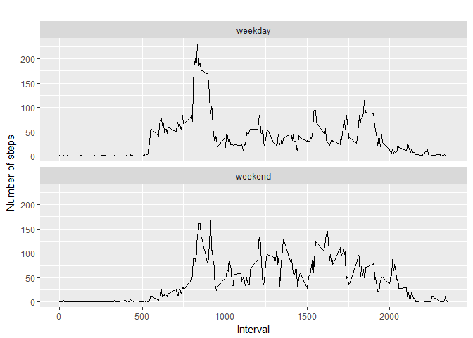

# Reproducible Research: Peer Assignement 1


```r
#load all packages used in this assignement
library(knitr)
library(dplyr)
```

```
## 
## Attaching package: 'dplyr'
```

```
## The following objects are masked from 'package:stats':
## 
##     filter, lag
```

```
## The following objects are masked from 'package:base':
## 
##     intersect, setdiff, setequal, union
```

```r
library(ggplot2)
#set up working directory
setwd("C:/Users/Dcollin/Desktop/RepData_PeerAssessment1")
```

## Loading and preproccessing the data

Show any code that is needed to:

1. Load the data (i.e. read.csv())

2. Process/transform the data (if necessary) into a format suitable for your analysis


```r
# load the data
actdata <- read.csv("activity.csv")

# remove NA in data
actdata2 <- actdata[with(actdata, {!(is.na(steps))}), ]

# print out first 10 rows
head(actdata2, 10)
```

```
##     steps       date interval
## 289     0 2012-10-02        0
## 290     0 2012-10-02        5
## 291     0 2012-10-02       10
## 292     0 2012-10-02       15
## 293     0 2012-10-02       20
## 294     0 2012-10-02       25
## 295     0 2012-10-02       30
## 296     0 2012-10-02       35
## 297     0 2012-10-02       40
## 298     0 2012-10-02       45
```

## What is mean total number of steps taken per day?

For this part of the assignment, you can ignore the missing values in the dataset.

1. Calculate the total number of steps taken per day

2. If you do not understand the difference between a histogram and a barplot, research the difference between them. Make a histogram of the total number of steps taken each day

3. Calculate and report the mean and median of the total number of steps taken per day


```r
# calculate the total number of steps taken per day
by_day <- group_by(actdata2, date)
steps_byday <- summarise(by_day, total=sum(steps))
steps_byday
```

```
## # A tibble: 53 x 2
##          date total
##        <fctr> <int>
##  1 2012-10-02   126
##  2 2012-10-03 11352
##  3 2012-10-04 12116
##  4 2012-10-05 13294
##  5 2012-10-06 15420
##  6 2012-10-07 11015
##  7 2012-10-09 12811
##  8 2012-10-10  9900
##  9 2012-10-11 10304
## 10 2012-10-12 17382
## # ... with 43 more rows
```

```r
#Make a histogram of the total number of steps taken each day
hist(steps_byday$total, main= "histogram of the total number of steps per day", xlab="Total number of steps in day", ylim=c(0, 30))
```

<!-- -->

```r
# Calculate and report the mean and median of the total number of steps per day
summary(steps_byday)
```

```
##          date        total      
##  2012-10-02: 1   Min.   :   41  
##  2012-10-03: 1   1st Qu.: 8841  
##  2012-10-04: 1   Median :10765  
##  2012-10-05: 1   Mean   :10766  
##  2012-10-06: 1   3rd Qu.:13294  
##  2012-10-07: 1   Max.   :21194  
##  (Other)   :47
```
**Mean of the total number of steps per day is 10766, Median is 10765**


## What is the average daily activity pattern?


1. Make a time series plot (i.e. type = "l") of the 5-minute interval (x-axis) and the average number of steps taken, averaged across all days (y-axis)

2. Which 5-minute interval, on average across all the days in the dataset, contains the maximum number of steps?


```r
# preprocessing data for plot
steps_byinterval <- aggregate(steps~interval, actdata2, mean)


# Create a time series plot
plot(steps_byinterval$interval, steps_byinterval$steps, type="l", main="Average number of steps over all days", xlab="Interval", ylab="Average number of steps")
```

<!-- -->

```r
# Find a row with max of steps
max_steps <- which.max(steps_byinterval$steps)

# find an interval with this max
steps_byinterval[max_steps, ] 
```

```
##     interval    steps
## 104      835 206.1698
```
**The interval 835 has the maximum average value of steps**


## imput missing values

Note that there are a number of days/intervals where there are missing values (coded as NA). The presence of missing days may introduce bias into some calculations or summaries of the data.

1. Calculate and report the total number of missing values in the dataset (i.e. the total number of rows with NAs)

2. Devise a strategy for filling in all of the missing values in the dataset. The strategy does not need to be sophisticated. For example, you could use the mean/median for that day, or the mean for that 5-minute interval, etc.

3. Create a new dataset that is equal to the original dataset but with the missing data filled in.

4. Make a histogram of the total number of steps taken each day and Calculate and report the mean and median total number of steps taken per day. Do these values differ from the estimates from the first part of the assignment? What is the impact of imputing missing data on the estimates of the total daily number of steps?


```r
# Total number of missing values in the original data (actdata)
sum(is.na(actdata))
```

```
## [1] 2304
```

** Total number of rows with NA's is 2304**

I picked the strategy of replacing NA's with the mean for that 5-minute interval.

```r
data_imputed  <- actdata
for (i in 1:nrow(data_imputed)) {
  if(is.na(data_imputed$steps[i])) {
    interval_value <- data_imputed$interval[i]
    steps_value <- steps_byinterval[steps_byinterval$interval                                        == interval_value,] 
    data_imputed$steps[i] <- steps_value$steps
  }
}
```


```r
# let's calculate the total number of steps taken each day.
steps_byday2 <- aggregate(steps~date, data_imputed, sum)
head(steps_byday2)
```

```
##         date    steps
## 1 2012-10-01 10766.19
## 2 2012-10-02   126.00
## 3 2012-10-03 11352.00
## 4 2012-10-04 12116.00
## 5 2012-10-05 13294.00
## 6 2012-10-06 15420.00
```

```r
hist(steps_byday2$steps, main="Histogram of the total number of steps per day(imputed", xlab="Total number of steps in a day")
```

<!-- -->

```r
# get mean and median steps of imputed data
mean(steps_byday2$steps)
```

```
## [1] 10766.19
```

```r
median(steps_byday2$steps)
```

```
## [1] 10766.19
```

```r
# get mean and median steps of data without NA's
mean(steps_byday$total)
```

```
## [1] 10766.19
```

```r
median(steps_byday$total)
```

```
## [1] 10765
```

** The mean values are the same, but there is a slight difference between the two median**


## Are there differences in activity patterns between weekdays and weekends?

For this part the weekdays() function may be of some help here. Use the dataset with the filled-in missing values for this part.

1. Create a new factor variable in the dataset with two levels - "weekday" and "weekend" indicating whether a given date is a weekday or weekend day.

2. Make a panel plot containing a time series plot (i.e. type = "l") of the 5-minute interval (x-axis) and the average number of steps taken, averaged across all weekday days or weekend days (y-axis). See the README file in the GitHub repository to see an example of what this plot should look like using simulated data.


```r
# create the new variable tday
data_imputed['tday'] <- weekdays(as.Date(data_imputed$date))
data_imputed$tday[data_imputed$tday  %in% c('Saturday','Sunday') ] <- "weekend"
data_imputed$tday[data_imputed$tday != "weekend"] <- "weekday"

# convert tday from character to factor
data_imputed$tday <- as.factor(data_imputed$tday)

# calculate average steps by interval accross all days
steps_byinterval2 <- aggregate(steps ~ interval + tday, data_imputed, mean)


# create an histogramme
qplot(interval, 
      steps, 
      data = steps_byinterval2, 
      geom=c("line"),
      xlab = "Interval", 
      ylab = "Number of steps", 
      main = "") +
  facet_wrap(~ tday, ncol = 1)
```

<!-- -->


